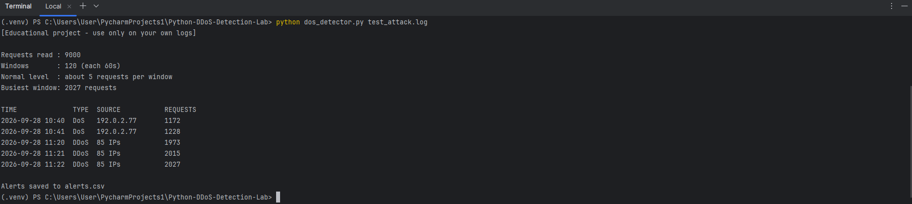
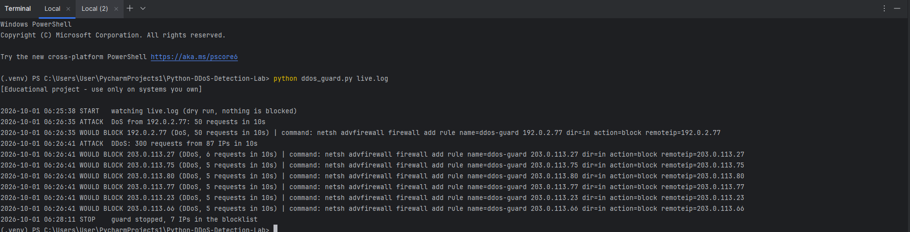
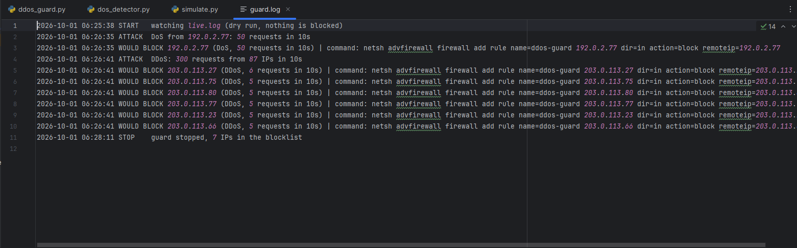

# Python DDoS Detection Lab

Small educational Python tools that look for DoS and DDoS attacks in web server access logs, and a real-time guard that reacts to an attack by showing the attacker's IP, blocking it and writing it to a log.

> **Educational project.** Everything here was written for learning and tested only on **fake (synthetic) logs**. Use it only on your own logs and systems, never against systems you do not own or have permission to test. Blocking is **off by default** (dry run).

## What is in this project

| File | What it does |
|---|---|
| `dos_detector.py` | Reads access log files and reports DoS and DDoS signs. Saves the alerts to `alerts.csv`. |
| `ddos_guard.py` | Watches a log file in real time. When it sees an attack it prints the IP, blocks it in the firewall (only with `--apply`) and writes `guard.log` and `blocked_ips.txt`. |
| `simulate.py` | Makes fake log lines (text only, no network traffic) so the other two scripts can be tested. |

Only the Python standard library is used. No extra packages are needed.

## How it detects attacks

The log is split into short time windows. In each window the script counts requests per IP address.

- **DoS:** one IP sends more requests than the limit in a window.
- **DDoS:** the total number of requests in a window is far above the normal level **and** the requests come from many different IPs.

Settings are constants at the top of each script and are easy to change:

| Setting | `dos_detector.py` | `ddos_guard.py` |
|---|---|---|
| Window size | 60 seconds | 10 seconds |
| DoS limit (one IP) | more than 100 requests | 50 requests |
| DDoS total limit | 10x normal and at least 300 | 300 requests |
| DDoS minimum IPs | 20 | 20 |

## How to run

```
python simulate.py batch
python dos_detector.py test_attack.log
```

Real-time guard (two terminal windows). First create an empty log file (PowerShell: `New-Item live.log -ItemType File`).

```
window 1:  python ddos_guard.py live.log
window 2:  python simulate.py live
```

By default the guard only prints `WOULD BLOCK` and the firewall command. Real blocking needs `--apply` and administrator rights (Windows uses `netsh`, Linux uses `iptables`).

## Results

### 1. Batch detector on the fake attack log

The test log has 9,000 requests: normal traffic (about 5 requests per minute) plus one fake DoS and one fake DDoS.

The detector found 5 alerts: the DoS from `192.0.2.77` (1,172 and 1,228 requests per minute) and the DDoS from 85 IPs (about 2,000 requests per minute, against a normal level of about 5).



### 2. Real-time guard

The guard saw the DoS from `192.0.2.77` (50 requests in 10 seconds) and the DDoS (300 requests from 87 IPs in 10 seconds). It marked the DoS source and the 6 most active DDoS IPs. The firewall commands are real Windows `netsh` commands, but nothing was executed because this is dry-run mode.



### 3. Log file

Every event is saved with a timestamp in `guard.log`, and the IPs are saved in `blocked_ips.txt`.



## Safety features

- **Dry run by default.** Nothing is blocked unless `--apply` is used.
- **Whitelist.** Local and private addresses (`127.`, `10.`, `192.168.`) are never blocked. Your own public IP should be added to the `WHITELIST` list in `ddos_guard.py`.
- **Block limit.** `MAX_BLOCKS` stops the script from blocking too many IPs by mistake.
- **No traffic generation.** The simulator only writes text lines into a file, using reserved test IP ranges (`192.0.2.x`, `203.0.113.x`, `198.51.100.x`).

## Limitations

- It works from log files, so it reacts after the requests have
